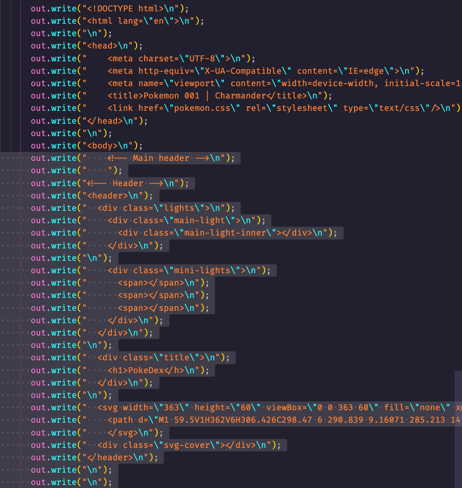
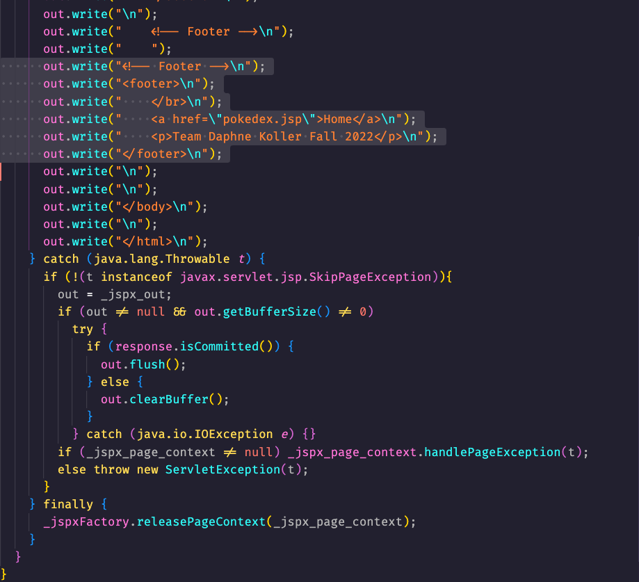

Presentation Outline

# Kue's information
**Explain our name:**

    About Daphne Koller
        Daphne Koller is an Israeli-American computer scientist and an adjunct professor at Standford. She co-founded Coursera in 2012, which is an online education platform. She recently founded insitro, which focuses on using machine learning in pharmaceutical research.

**Introduce our team members. Describe our roles and skills that were brought to the team:**

    Clayton Mays
        Role: Created repository and templates for code. Created charmander jsp. Recorded presentation.
    Erick Reyes
        Role: Researched best practices and drawbacks. Created bulbasaur jsp. Put together presentation outline.
    Kue Xiong
        Role: Researched Daphne Koller and concept. Created Squirtle jsp and CSS file for header and footer.

**The name of our technology/concept:**

    @include Directive

**Description of our technology/concept:**

    The @include directive is used to include other files, such as another JSP file. As with breaking down Java code into multiple classes for organization and ease of maintanence, the @include directive allows various components to live on their own file. When something needs to be modified or debugged, only the source file has to be fingled with. This also allows the external files to be dynamic without cluttering the main JSP file.

---
# Clayton's information
**Syntax example:**

**Practical example:**

---
# Erick's information
**Demonstrate / screenshot how the jsp gets translated:**

    A JSP file gets compiled whenever the browser requests it. Specifically in two cases: the JSP was never compiled or was modified recently. The following screenshots were taken in the tomcat/work/Catalina/localhost/java112/org/apache/jsp/ directory.

**Screenshot of header parsed within the servlet (highlighted)**

**Screenshot of footer parsed within the servlet (highlighted)**

**Explain best practices:**

    A good practice is to keep dynamic (changing) parts of a website in seperate files. Then include them in the main file. It makes it easier to make changes to a website if content is in a seperate file.

    Splitting a main file into chunks is a good use case for inclusion. For example, a component that is common among many pages is a good use case for inclusion as well.
    A navigation bar that is persisent across a website / webapp is a great example.
**Explain drawbacks**:

    However, splitting those chunks into more chunks is not advised. It would get redundant and slowing rendering down due to loading more files than necessary.

    The include directive is limited to including files on the host server. It cannot include files from a different website or FTP server.

